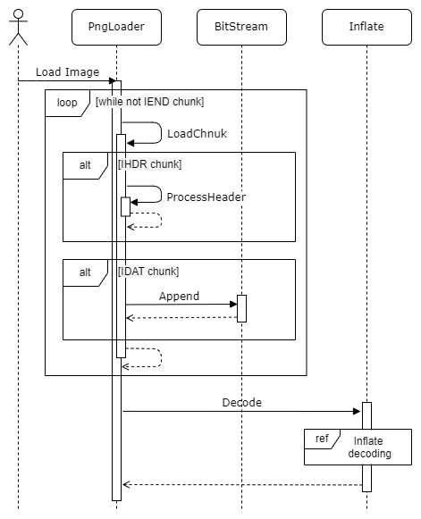
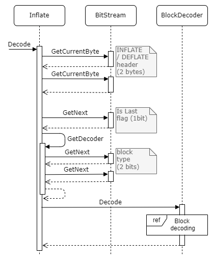
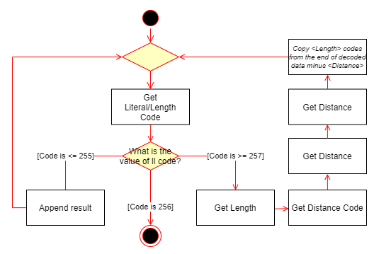

# Common
Static library containing shared functionality

## (WIP)JpegImage
- jpeg image decoder
- Referencess:
- - [Anatomy of a JPEG](https://www.ccoderun.ca/programming/2017-01-31_jpeg/)
  - [TODO](TODO) 
- - TODO

## PngImage
- PNG image decoder
- Referencess:
    - [PNG Specification](https://www.w3.org/TR/PNG/)
    - [RFC 1950 "ZLIB Compressed Data Format Specification"](https://datatracker.ietf.org/doc/html/rfc1950)
    - [RFC 1951 "DEFLATE Compressed Data Format Specification"](https://datatracker.ietf.org/doc/html/rfc1951)
- **Unsupported features:**
    - Only RGB and RGBA pixel formats are supported
    - Interface method [ADAM7](https://en.wikipedia.org/wiki/Adam7_algorithm) is not supported
    - Only 8 bit channels are supported
    - Zlib/Inflate block type 00 is not supported (uncompressed block)

### Class Model


### Decoding

#### Pre-processing

Pre processing step consist of loading png data chunks, checking for compatibility and re-creating bit stream:
1. Load chunks (until IEND chunk is loaded)
    1. Check Header for compatibility (IHDR chunk)
    2. Append data to bitstream (IDAT chink)
2. Decode bitstream



```
open file
LOOP
   load chunk
   IF chunk type is "IHDR"
       process header and check for compatibility
   ELSE IF chunk type is "IDAT"
       append bit stream with chunk data
   ELSE IF chunk type is "IEND"
       BREAK
   ENDIF
ENDLOOP
close file
decode data
```

#### Decoding (ZLIB / INFLATE)

Bit stream starts with two byte header. 
Header is followed by series of encoded blocks.
Each block starts with **3 bit** header:
- 1 bit is last flag (this last block)
- 2 tib type:
    - type 00 - no compression (**note: not yet supported**)
    - type 01 - encoded with fixed "huffman" codes
    - type 10 - encoded with dynamic huffman codes
    - type 11 - error / invalid type

[[DEFLATE specification, section  3.2.3.]](https://datatracker.ietf.org/doc/html/rfc1951#section-3.2.3)



**Block Type 10** 

Block type 10 start with its own header:
- 5 bit hlit (hlit + 257 literal / length (ll) codes)
- 5 bit hdist (hdist + 1 distance codes)
- 4 bit hclen (hclen + 4 code lengths)

After header follows (hclen + 4) \* 3 bites of code lengths used for decoding two alphabets (literal / length alphabet and distance alphabet).
Folowed by encoded alphabets. 

[[DEFLATE specification, section  3.2.7.]](https://datatracker.ietf.org/doc/html/rfc1951#section-3.2.7)

**Decoding block types 01 and 10**

To decode data, literal / length code is decoded first according to ll alphabet.
- Codes less up to 255 (inclusive) represent raw data
- Code 256 represents end-of-block
- Remaining codes represent length

If length code was decoded, code is decoded into actuall length (length codes represent range of lengths, additional bits may be needed to get length).
Get and decode distance. Copy **\<lengt\>** bytes from end-of-decoded-data minus **\<distance\>** to result.



#### Post-processing

Last step to get pixels is reverse filterinf step.
Every image line starts with one byte filtration type
(png supports 5 filters - none, sub, up, average, paeth). [[PNG specification, section 9.2.]](https://www.w3.org/TR/PNG/#9Filters)
