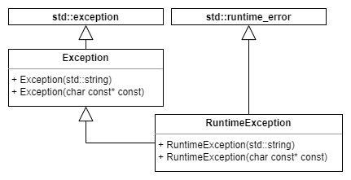
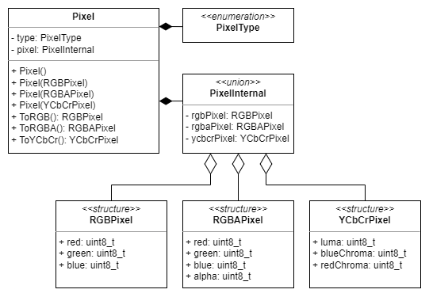
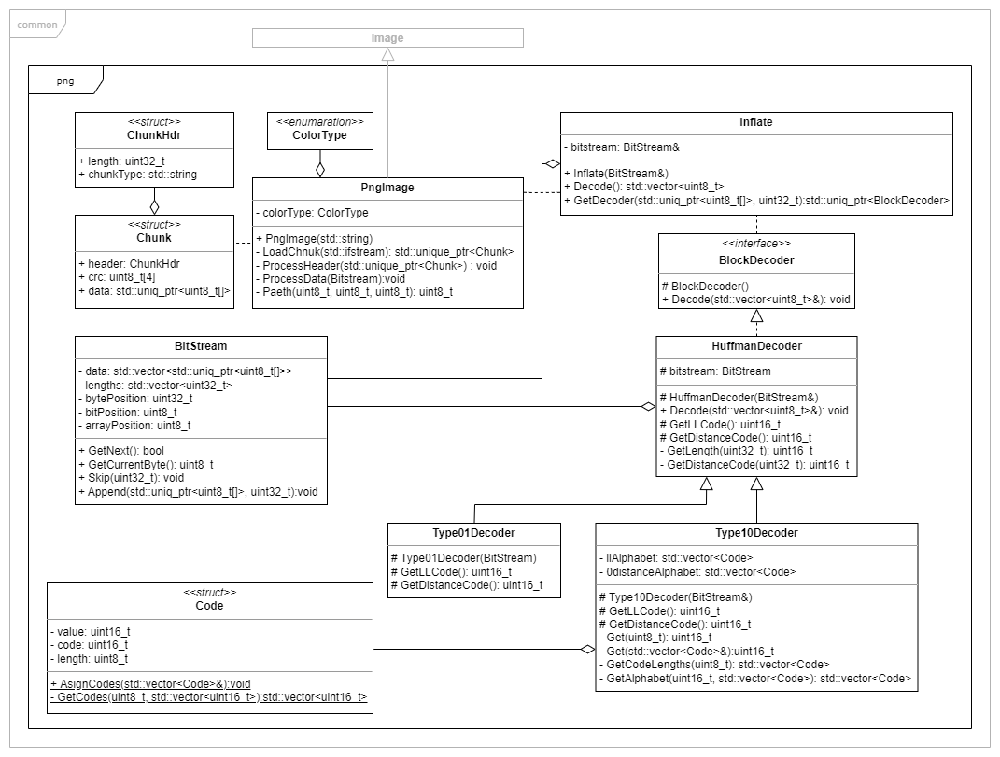
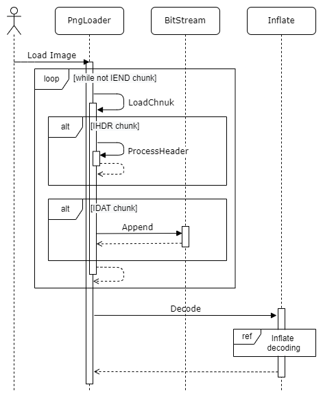
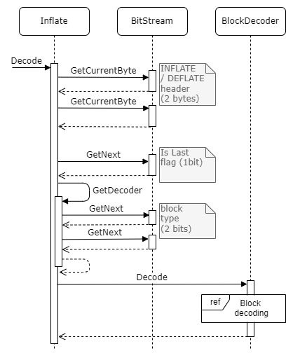
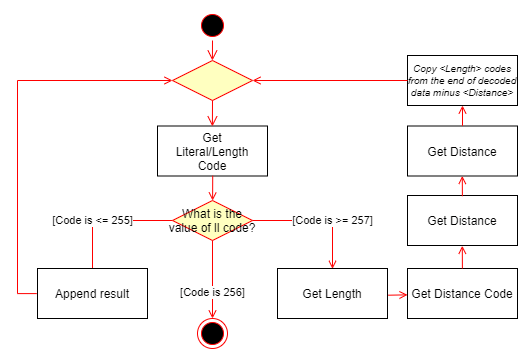

# Common
Static library containing shared functionality

## Overview

### BitmapLoader
- Loads image data from bitmap (.bmp) file

### BitStream
- Simplifies access to bits from byte arrays
- Handles moving in stream

### CommandLineParser
- Parses command line arguments
- Creates key-value pairs of command line option and its argument list

### Exception (and RuntimeException)
- Exception for differentiating between project exceptions and standard exceptions



### GifLoader
- Loads gif image
- **Limmited support**
    - Animation is not supported
- Referencess:
    - [gif blog](https://www.matthewflickinger.com/lab/whatsinagif/index.html)

### Image
- Contains ability to get and set particular pixel

### ImageLoader
- Loads requested image
- Checks content to determine which image format is used

### JpegLoader
- jpeg image decoder
- Scroll down for more details

### Pixel
- Represents pixel
- Enables conversion to:
   - RGB 
   - RGBA 
   - YCbCr



### [PngLoader]
- PNG image decoder
- Scroll down for more details

### RawLoader
- Loads image data from RAW image file

### Window
- Displaying images based on their starting position:
    - First Pixel being top left
    - First Pixel being bottom left
- Keyboard and joystick / gamepad inouts are supported
- Arrow keys, WASD and joystick for moving image
- Zoom in and out:
    - \+ and RT (Right Trigger) to zoom in;
    - - and LT (Left Trigger) to zoom out;

## JpegLoader
- jpeg image decoder
- Referencess:
    - [Anatomy of a JPEG](https://www.ccoderun.ca/programming/2017-01-31_jpeg/)
- **Supported features:**
    - baseline DCT is supported (no progressive DCT))
    - 8 bit resolution is supported (no 16bit)
    - 3 color components (no grayscale or CMYK)
    - 4:4:4 and 4:2:0 chroma subsampling

### Class Model
TODO: add class model 

### JPEG blocks
Jpeg image is split into blocks
Every block starts with 0xff followed by block ID.
Most of the blocks (except SOI and EOI) are followed by 2byte size field. The size includes payload size + the size 2bytes.
After size field is size -2 bytes os block payload

| Block           | Size      | Meaning                                      |
|-----------------|-----------|----------------------------------------------|
|0xff 0xd8        | n/a       | **S**tart **o**f **i**mage                   |
|0xff 0dd9        | n/a       | **E**nd **o**f **i**mage                     |
|0xff 0xdb        | 67/131    | **D**efine **Q**uantization **T**ables       |
|0xff 0xc4        | <varies\> | **D**efine **H**uffman **T**ables            |
|0xff 0xc0        | 11-20     | **S**tart **o**f **F**rame (baseline DCT)    |
|0xff 0xda        | 10-14     | **S**tart **o**f **S**can                    |
|0xff 0xfe        | <varies\> | **Com**ment                                  |
|0xff 0xc2        | <varies\> | **S**tart **o**f **F**rame (progressive DCT) |
|0xff 0xe0 - 0xef | <varies\> | Image metadata                               |

**0xff 0xd8** (SOI) and **0xff 0xd9** (EOI) blocks represent start and end of iomage. 
These markers are first and last markers in the image respectivelly.

**0xff 0xdb** (DQT) contains quantization table in zig-zag order. 
First byte is split into two halves. First half (most significant) defines the precission of table, either 8bit or 16bit. The second half (least significant) specifies the type of the quantization table, either luminance or chrominance. The payload size depends on the precission - 2 (size field) + 1 (precission and type byte) + 32 / 64 (quantization table in zig-zagt order). There can be multiple DQT blocks in a single image (usually 2).

**0xff 0xc4** (DHT) defines huffman tables.
The jpeg defines two types of huffman tables - AC or DC (will be explained later in decoding part).
First byte is split into two halves. First half (most significant) defines the table type (AC or DC). The second half (least significant) defines a table ID.
Next 16 bytes defines number of codes of given length (from 1 to 16bits).
Remaining bytes (sum of all values in previous section) define codes, ordered based on their lengths.

| Start (byte) | Size      | Meaning                         |
|--------------|-----------|---------------------------------|
| 0            | 1/2       | Table type                      |
| 1/2          | 1/2       | Table ID                        |
| 1            | 16        | Number of codes of given length |
| 17           | <varies\> | Codes                           |

**0xff 0xc0** (SOF) contains information about image

| Start (byte)  | Size         | Meaning                         |
|---------------|--------------|---------------------------------|
| 0             | 1            | Precission                      |
| 1             | 2            | Image height                    |
| 3             | 2            | Image Width                     |
| 5             | 1            | Number of color components      |
| 6             | 3*components | For every color component contais component (1byte), sampling factor width and height (1/2 byte & 1/2 byte) and quantization table ID |

**0xff 0xda** (SOS) contains informations needed for Entropy decoding like mapping Huffman tables to color components.

| Start (byte)     | Size         | Meaning                         |
|------------------|--------------|---------------------------------|
| 0                | 1            | Number of components            |
| 1                | 2*components | Color component ID (1byte), DC huffman Table (1/2byte) and AC huffman table (1/2byte) |
| 1 + 2*components | 3            | other                           |

### Entropy Decoding
After the SOS marker follows the compressed (entropy encoded) bit stream. The stream ends with EOI marker.
There are two special rules for handling the bit stream. Since the value 0xff has special meaning (marker) in jpeg, to differentiate between a marker (like EOI) and a series of 1s in bit stream, the value is escaped. A 0xff byte followed by 0x00 byte is converted to single 0xff value in bit stream. The second special case are markers 0xff followed by any value from 0xd0 to 0xd7. These combinations are called restart markers and will be discussed shortly.
The jpeg image is not only split into 8by8 blocks but also into Minimal Coded Units (MCU). The MCU combines the 8x8 blocks and chroma up/downsampling. If there is now downsampling in image (aka 4:4:4), the MCU consists of 3 8by8 blocks (assuming 3 color components mode YCbCr). For more common cases (4:2:0), where Y component has 4times more detail than Cb or Cr components, the MCU is 16by16.
The SOF blocks contains information about components and their sampling factors. For example if Y component has width and height sampling factors equal to 2, it means there will be 2(width) * 2(height) 8by8 Y blocks in the MCU. The remaining two (Cb and Cr) components usually have the factors set to 1, which means there will be one 8by8 Cb and one 8by8 Cr block in MCU.

The 8by8 block is split into one DC (first) and 62 AC values. The DC value is encoded as difference from previous block value. The remaining values are encoded as is.
Unlike png or gif, the jpeg bit stream is stored most significant bit first (the very first bit from stream is value & 1 << 7)

```
Set DC coeficients to 0
LOOP over all color components
   LOOP sampling factor width * sampling factor height
      Decode value using DC huffman table
      Read DC number of bits
      Interpret bits as signed number
      Add value to DC coeficients
      Set value as first element of block
      
      LOOP 63 times
        Decode value using AC table
          IF value is 0
            All remaining values are 0
          ENDIF
          
          IF value is 0x0f
            Add 16 zeroes
          ENDIF

          First half of byte is zero run length
          Second half defines number of bits to read
          Interpret bits as signed number
          Add value to block
      ENDLOOP
   ENDLOOP
ENDLOOP

```

The first decoded value (lets call it x) is length if bits decoded with DC huffman table for that component.
Next read lengths (x) bits. If the first bit is 1, the number is positive and returned as read. If the bit is 0, the number is negative and is: **number - 2^(number of read bits) - 1**
Add this number to previous DC value and store it as first value of the 8by8 block.
Next 63 values are decoded using the AC huffman table for that component. The decoding process is somawhat simmilar.
For AC values there are two special values: **0x00** and **0x0f**. When 0x00 is decoded, the AC decoding ends and all remaining values of block are set to 0. If **0x0f** is detected, 16 zeroes is added to block.
All other values represent 1/2 of byte zeroes run and 1/2 byte length of value. First half of decoded byte represents how many zeroes are added to block. The second represents how many additional bits are read and interpreted ad signed number (in the same way as DC value).

NOTE: The previous DC coeficient is 0 for first block of image or when restart marker is detected.

### Re-assembling image

```
LOOP MCU Blocks
    Decode block
    Dequantization
    Zig-Zag reorder
    Inverse Discreete Cosine transform
ENDLOOP

Upsampling
Add MCU to Image
```

Both 8by8 block and Quantization tables are stored in zig-zag order. After decoding, block is elementwise multiplied with quantization table (not matrix multiplication).
After dequantization (elementwise multiplication), the block is reordered from zig-zag order to natural order needed by IDCT.
Inverse DCT is applied.
After all MCU blocks are decoded, tey are put together to image. The ordering of blocks in MCU and MCUs in image is the same left-to-right, top-to-bottom (First block / MCU os top left, last bottom right).

## PngLoader
- PNG image decoder
- Referencess:
    - [PNG Specification](https://www.w3.org/TR/PNG/)
    - [RFC 1950 "ZLIB Compressed Data Format Specification"](https://datatracker.ietf.org/doc/html/rfc1950)
    - [RFC 1951 "DEFLATE Compressed Data Format Specification"](https://datatracker.ietf.org/doc/html/rfc1951)
- **Unsupported features:**
    - Interface method [ADAM7](https://en.wikipedia.org/wiki/Adam7_algorithm) is not supported
    - 16bit channels **not** supported
    - Zlib/Inflate block type 00 is not supported (uncompressed block)

### Class Model



### Decoding

#### Pre-processing

Pre processing step consist of loading png data chunks, checking for compatibility and re-creating bit stream:
1. Load chunks (until IEND chunk is loaded)
    1. Check Header for compatibility (IHDR chunk)
    2. Append data to bitstream (IDAT chink)
2. Decode bitstream



```
open file
LOOP
   load chunk
   IF chunk type is "IHDR"
       process header and check for compatibility
   ELSE IF chunk type is "IDAT"
       append bit stream with chunk data
   ELSE IF chunk type is "IEND"
       BREAK
   ENDIF
ENDLOOP
close file
decode data
```

#### Decoding (ZLIB / INFLATE)

Bit stream starts with two byte header. 
Header is followed by series of encoded blocks.
Each block starts with **3 bit** header:
- 1 bit is last flag (this last block)
- 2 tib type:
    - type 00 - no compression (**note: not yet supported**)
    - type 01 - encoded with fixed "huffman" codes
    - type 10 - encoded with dynamic huffman codes
    - type 11 - error / invalid type

[[DEFLATE specification, section  3.2.3.]](https://datatracker.ietf.org/doc/html/rfc1951#section-3.2.3)



**Block Type 10** 

Block type 10 start with its own header:
- 5 bit hlit (hlit + 257 literal / length (ll) codes)
- 5 bit hdist (hdist + 1 distance codes)
- 4 bit hclen (hclen + 4 code lengths)

After header follows (hclen + 4) \* 3 bites of code lengths used for decoding two alphabets (literal / length alphabet and distance alphabet).
Folowed by encoded alphabets. 

[[DEFLATE specification, section  3.2.7.]](https://datatracker.ietf.org/doc/html/rfc1951#section-3.2.7)

**Decoding block types 01 and 10**

To decode data, literal / length code is decoded first according to ll alphabet.
- Codes less up to 255 (inclusive) represent raw data
- Code 256 represents end-of-block
- Remaining codes represent length

If length code was decoded, code is decoded into actuall length (length codes represent range of lengths, additional bits may be needed to get length).
Get and decode distance. Copy **\<lengt\>** bytes from end-of-decoded-data minus **\<distance\>** to result.



#### Post-processing

Last step to get pixels is reverse filterinf step.
Every image line starts with one byte filtration type
(png supports 5 filters - none, sub, up, average, paeth). [[PNG specification, section 9.2.]](https://www.w3.org/TR/PNG/#9Filters)
