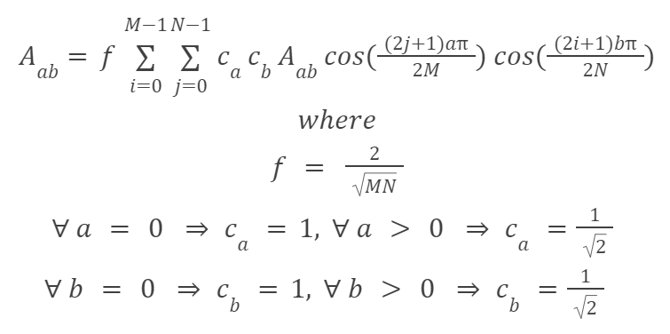
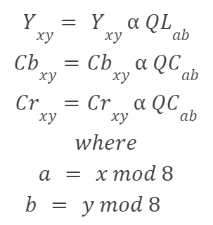
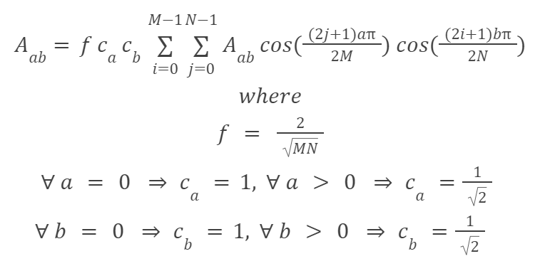

# Image Compression

- Simplified loosy compression algorithm (DCT - Discrete Cosine Transform method)
    - simmilar to what jpeg uses
- Parallelised using C++'s [std::thread](https://en.cppreference.com/w/cpp/thread/thread)

## Examples
### 3% Quality

### 10% Quality

### 95% Quality


## Workflow


Following formula is used to calculate alpha from quality:


Two dimmensional Discrete Cosine Transformation is calculated according to following formula,
where M and N are width and height of block


For Quantization was used following formula,
where
- QL and QC are quantization tables
- x and y are pixel loactions in image
- a and b are location in quantization table (1-7)
- y, Cb and Cr are pixel components from YCbCR color space
- alpha was calculated with corresponding formula mentioned above


For dequantization was used following formula:



Two dimmensional Inverse Discrete Cosine Transformation is calculated according to following formula,
where M and N are width and height of block


## Class model


## Command line options
### Display help
```
    ./Compression -h
    ./Compression --help
```
### Set Quality
```
    ./Compression -q <quality_from_0_to_100%>
    ./Compression --quality <quality_from_0_to_100%>
```
### Set image
```
    ./Compression -f <image>
    ./Compression --file <image>
    ./Compression -f <raw_image> <image_width> <image_height>
    ./Compression --file <raw_image>  <image_width> <image_height>
```