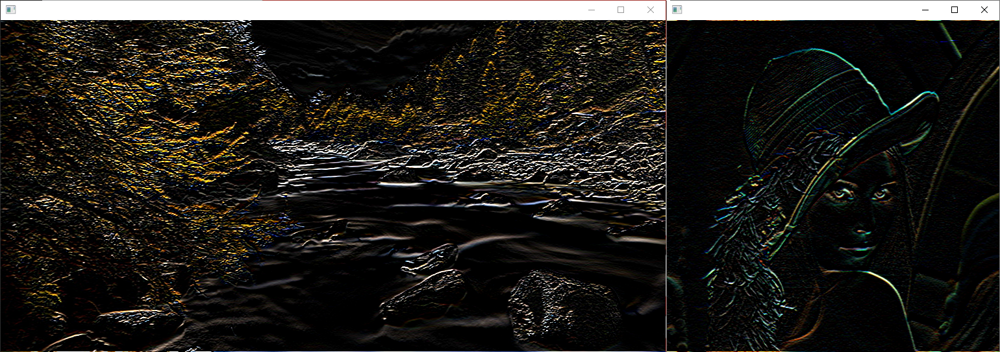

# Convolution Filter

Application for applying convolution filter on input image

### EdgeDetection


### Sharpen


### Sobel


## Command line options
### Display help
```
    ./ConvolutionFilter -h
    ./ConvolutionFilter --help
```
### Set kernel
```
    ./ConvolutionFilter -k <kernel_name>
    ./ConvolutionFilter -k <kernel_file>
    ./ConvolutionFilter --kernel <kernel_name>
    ./ConvolutionFilter --kernel <kernel_file>
```
### Print kernel
```
    ./ConvolutionFilter -p
    ./ConvolutionFilter --print
```
### Set image
```
    ./ConvolutionFilter -f <bitmap_image>
    ./ConvolutionFilter --file <bitmap_image>
    ./ConvolutionFilter -f <raw_image> <image_width> <image_height>
    ./ConvolutionFilter --file <raw_image>  <image_width> <image_height>
```