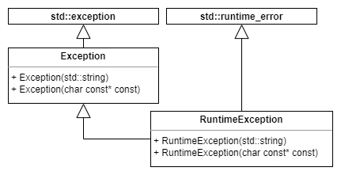
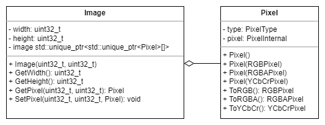
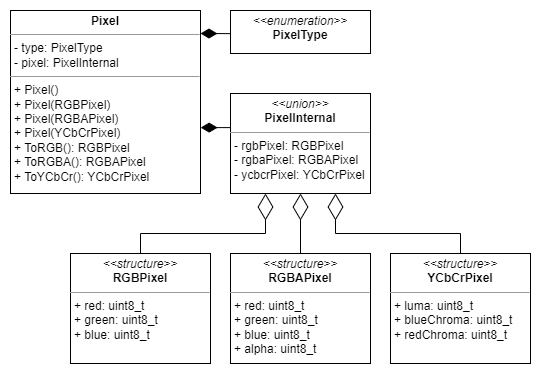
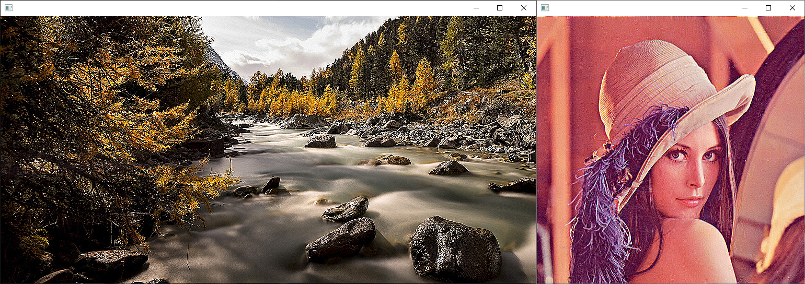
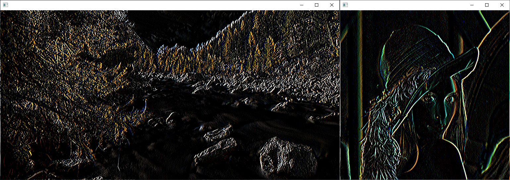

# Image Processing
- CMake based projects related to Image Processing
- C++14
- Unit tests written for Google Test framework
- All project support following image formats:
    - RAW
    - Bitmap (.bmp)
    - Portable Network Graphics (.png)
        - RGB and RGBA only
        - [DAM7](https://en.wikipedia.org/wiki/Adam7_algorithm) is not supported
        - Only 8 bit channels are supported

## Common
Static library containing shared functionality

### BitmapImage
- Loads image data from .bmp file

### BitStreamer
- Enables accesing series of bytes as a bit stream
- Reads current bit and increases position

### CommandLineParser
- Parses command line arguments
- Creates key-value pairs of command line option and its argument list

### Exception
- Exception for differentiating between project exceptions and standard exceptions

### Image
- Contains ability to get and set particular pixel

### Pixel
- Represents pixel
- Enables conversion to:
   - RGB 
   - RGBA 
   - YCbCr

### (WIP) PngImage
- PNG image decoder
- Referencess:
    - [PNG Specification](https://www.w3.org/TR/PNG/)
    - [RFC 1950 "ZLIB Compressed Data Format Specification"](https://datatracker.ietf.org/doc/html/rfc1950)
    - [RFC 1951 "DEFLATE Compressed Data Format Specification"](https://datatracker.ietf.org/doc/html/rfc1951)
- Unsupported features:
    - Only RGB and RGBA pixel formats are supported
    - Interface method [DAM7](https://en.wikipedia.org/wiki/Adam7_algorithm) is not supported
    - Only 8 bit channels are supported
- TBD Class diagram ?
- TBD Sequence diagram ?
- TBD Other UML Ddiagrams ?

### RawImage
- Loads image data from RAW image file

### RGBAPixel
- Structure for encapsulating RGBA data

### RGBPixel
- Structure for encapsulating RGB data

### RuntimeException
- Exception for differentiating between project exceptions and standard exceptions

### Window
- Displaying images
- Arrow keys and WASD for moving image
- \+ and - for zoom in and out

### YCbCrPixel
- Structure for encapsulating YCbCr data

## [Convolution Filter](ConvolutionFilter)
- Application for applying convolution filter on input image
- Parallelised using std::thread
- Displays result in a winfow
- Uses strategy pattern to handle commandline arguments:
    - `-h` or `--help`: displays help
    - `-f` or `--file`: followed by path to bitmap image file to be displayed
    - `-f <file> <width> <height>` or `--file <width> <height>`: raw image file to be displayed followed by its width and height
    - `-k` or `--kernel`: specifies kernel to be applyed, supports list of pre-defined kernels or a file input (input file must contain only numbers separated by space)
    - `-p` or `--print`: prints out kernel specified with --kernel option

### Sharpen

### Sobel

## [Image Viewer](ImageViewer)
- Application for displaying raw and bmp images
- Uses strategy pattern to handle commandline arguments:
    - `-h` or `--help`: displays help
    - `-f` or `--file`: followed by path to bitmap image file to be displayed
    - `-f <file> <width> <height>` or `--file <width> <height>`: raw image file to be displayed followed by its width and height

