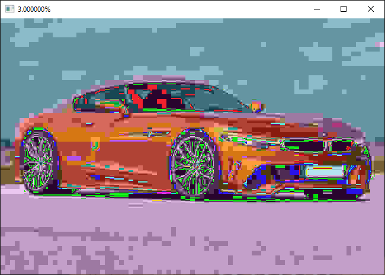
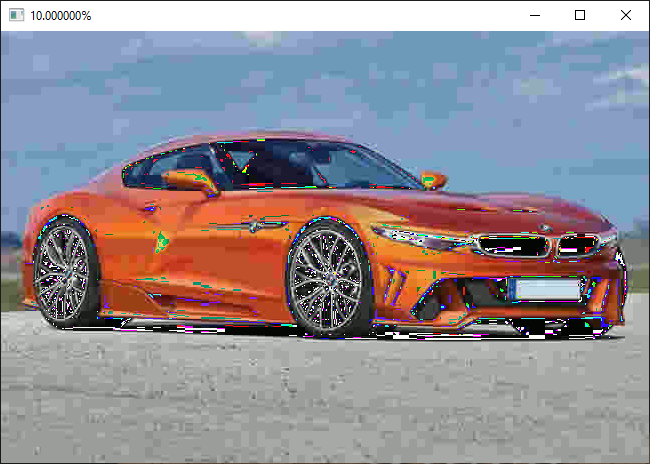
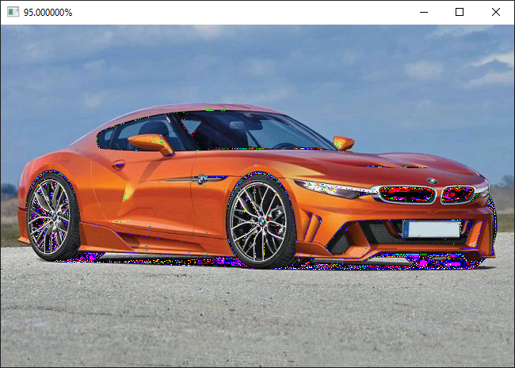
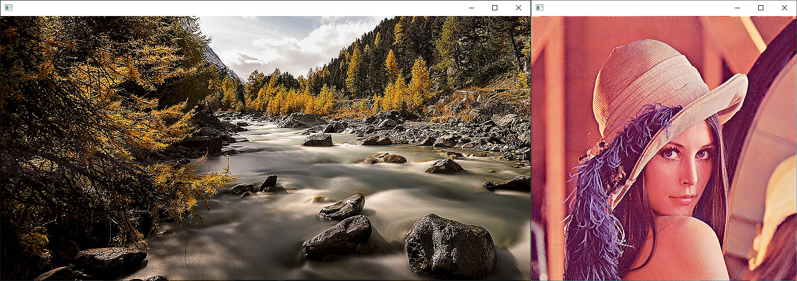
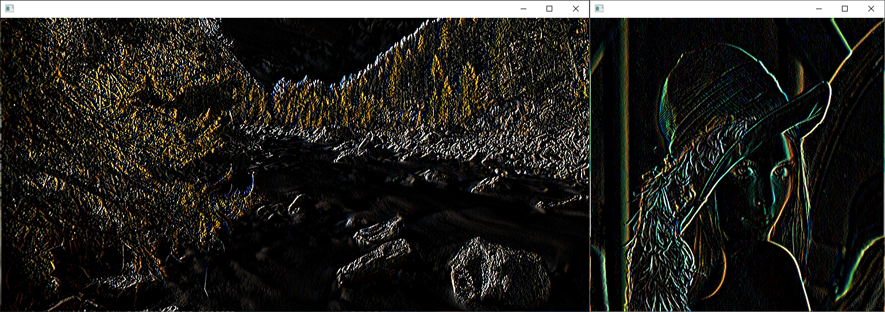

# Image Processing
- CMake based projects related to Image Processing
- Written in C++17
- Parallelised using:
    - [std::thread](https://en.cppreference.com/w/cpp/thread/thread)
    - [Nvidia CUDA](https://developer.nvidia.com/cuda-zone)
- Unit tests written for Google Test framework
- All project support following input image formats:
    - RAW
    - Bitmap (.bmp)
    - Graphics Interchange Format (.gif)
        - **NOTE:** only limited support
    - Joint Photographic Experts Group (.jpg)
        - **NOTE:** not the whole standard is supported.
    - Portable Network Graphics (.png) 
        - **NOTE:** not the whole standard is supported.
- Projects overview:
    - [Common library (shared functionality)](Common)
    - [DCT Image compression](Compression)
    - [Convolution Filter](ConvolutionFilter)
    - [Image Viewer](ImageViewer)

## [Common](Common)
Static library containing shared functionality for:
- loading raw, bitmap, png, gif and jpeg images. 
- displaying images
- exceptions
- command line parsing
- other

**Note**: Some image formats don't have full support. For more details see [Common](Common).

## [Compression](Compression)
- Simplified loosy jpeg compression algorithm (DCT - Discrete Cosine Transform method)
- Parallelised using C++'s [std::thread](https://en.cppreference.com/w/cpp/thread/thread)

### 3% Quality

### 10% Quality

### 95% Quality

## [Convolution Filter](ConvolutionFilter)
- Application for applying convolution filter on input image
- Parallelised using:
    - [Nvidia CUDA](https://developer.nvidia.com/cuda-zone) (if supported) or
    - C++'s [std::thread](https://en.cppreference.com/w/cpp/thread/thread)
- Displays result in a winfow
- Uses strategy pattern to handle commandline arguments

### Sharpen

### Sobel

## [Image Viewer](ImageViewer)
- Application for displaying raw, bmp and png images
- Uses strategy pattern to handle commandline arguments

