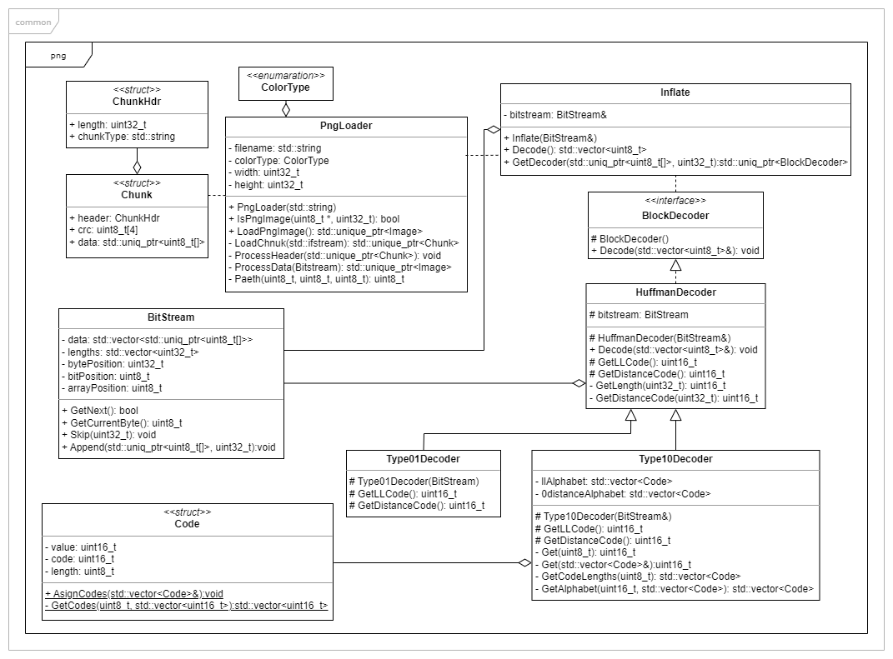

# Image Processing
- CMake based projects related to Image Processing
- Written in C++
- Parallelised using [std::thread](https://en.cppreference.com/w/cpp/thread/thread) and / or [Nvidia CUDA](https://developer.nvidia.com/cuda-zone)
- Unit tests written for Google Test framework
- All project support following input image formats:
    - RAW
    - Bitmap (.bmp)
    - Graphics Interchange Format (.gif)
        - **NOTE:** only limited support
    - Portable Network Graphics (.png) 
        - **NOTE:** not the whole standard is supported, scroll down for list of unsupported features.
- Projects overview:
    - [Common library (shared functionality)](Common)
    - [DCT Image compression](Compression)
    - [Convolution Filter](ConvolutionFilter)
    - [Image Viewer](ImageViewer)

## [Common](Common)
Static library containing shared functionality

### BitmapLoader
- Loads image data from bitmap (.bmp) file

### BitStream
- Simplifies access to bits from byte arrays
- Handles moving in stream

### CommandLineParser
- Parses command line arguments
- Creates key-value pairs of command line option and its argument list

### Exception (and RuntimeException)
- Exception for differentiating between project exceptions and standard exceptions

### GifLoader
- Loads gif image
- **Limmited support**
    - Animation is not supported
- Referencess:
    - [gif blog](https://www.matthewflickinger.com/lab/whatsinagif/index.html)

### Image
- Contains ability to get and set particular pixel

### ImageLoader
- Loads requested image
- Checks content to determine which image format is used

### Pixel
- Represents pixel
- Enables conversion to:
   - RGB 
   - RGBA 
   - YCbCr

### [PngLoader](Common)
- PNG image decoder
- Referencess:
    - [PNG Specification](https://www.w3.org/TR/PNG/)
    - [RFC 1950 "ZLIB Compressed Data Format Specification"](https://datatracker.ietf.org/doc/html/rfc1950)
    - [RFC 1951 "DEFLATE Compressed Data Format Specification"](https://datatracker.ietf.org/doc/html/rfc1951)
- **Unsupported features:**
    - Indexed color is not supported.
    - Interface method [ADAM7](https://en.wikipedia.org/wiki/Adam7_algorithm) is not supported
    - Only 8 bit channels are supported
    - Zlib/Inflate block type 00 is not supported (uncompressed block)

### RawLoader
- Loads image data from RAW image file

### Window
- Displaying images based on their starting position:
    - First Pixel being top left
    - First Pixel being bottom left
- Keyboard and joystick / gamepad inouts are supported
- Arrow keys, WASD and joystick for moving image
- Zoom in and out:
    - \+ and RT (Right Trigger) to zoom in;
    - - and LT (Left Trigger) to zoom out;

## [Compression](Compression)
- Simplified loosy jpeg compression algorithm (DCT - Discrete Cosine Transform method)
- Parallelised using C++'s [std::thread](https://en.cppreference.com/w/cpp/thread/thread)

### 3% Quality

### 10% Quality

### 95% Quality

## [Convolution Filter](ConvolutionFilter)
- Application for applying convolution filter on input image
- Parallelised using:
    - [Nvidia CUDA](https://developer.nvidia.com/cuda-zone) (if supported) or
    - C++'s [std::thread](https://en.cppreference.com/w/cpp/thread/thread)
- Displays result in a winfow
- Uses strategy pattern to handle commandline arguments

### Sharpen

### Sobel

## [Image Viewer](ImageViewer)
- Application for displaying raw, bmp and png images
- Uses strategy pattern to handle commandline arguments

